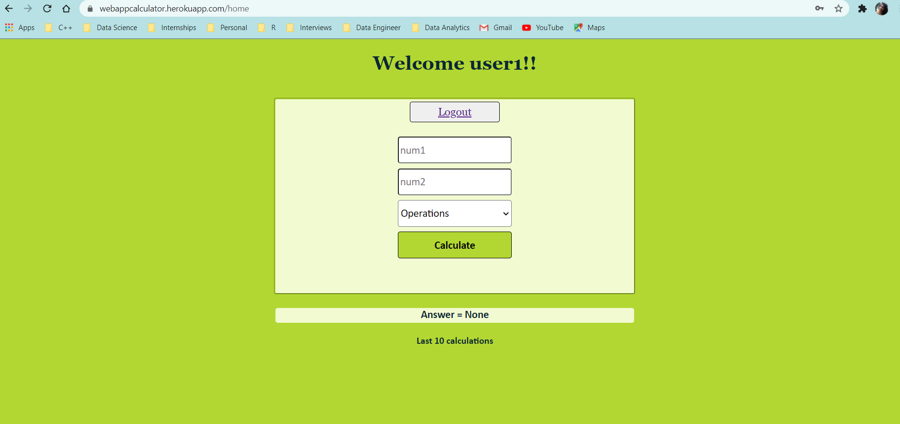

# OnlineCalculator
A webapp to calculate basic numerical operations like addition, subtraction, multiplication and division for two numbers.

# Application Link

https://webappcalculator.herokuapp.com/

# Instructions

<li>Click on the webapp link</li>
<li>Login with any one of the two credentials given below in user information</li>
<li>Enter number1 in first input text</li>
<li>Enter number2 in second input text</li>
<li>Select the operation</li>
<li>Click Calculate</li>
<li>Result in shown on the webpage along with the last 10 calculations performed by all users using this application</li>
<li>Click logout to leave the session</li>

# Technology

Web Development - Python, Flask, HTML, CSS

Database - PostgresSQL

Deployment - Heroku

Supports DEV and PROD environment -> change variable ENV

# Files

<li>app.py : Flask code</li>
<li>requirements.txt : list of libraries required to run application </li>
<li>Procfile : heroku deployment file</li>
<li>tablescript.sql : SQL code for creating tables on Postgres </li>
<li>runtime.txt : Specify the Python version for Heroku deployment

# User Information

Currently supports for only two users

username : user1 , password : user1

username : user2, password : user2

Note : If more users are to be added please add the new user object in class Users (file app.py code line #87 to #89)

If any other user credentials are added the code will redirect to login page itself

# UI

